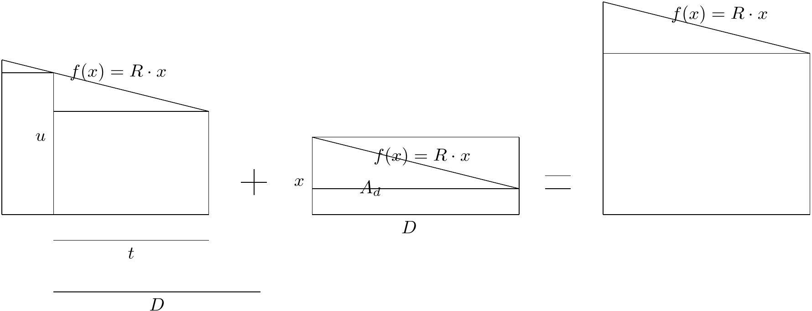

<!-- `((d^(2)*r))/(2)+(x-(d*r))*d =((t^(2)*r))/(2)+(u-((t^(2)*r))/(2)*t)+((d^(2)*r))/(2)+(a-(d*r))*d` -->

<!--
$$
\frac{\left(d^2\cdot r\right)}{2}+\left(x-\left(d\cdot r\right)\right)\cdot d\ =\left(\frac{\left(t^2\cdot r\right)}{2}+\left(u-\frac{\left(t^2\cdot r\right)}{2}\right)\cdot t\right)+\frac{\left(d^2\cdot r\right)}{2}+\left(a-\left(d\cdot r\right)\right)\cdot d
$$ -->

This is the equation for upkeep area updates

$$
A_{n+1}=A_{n} + A_{d}
$$

$A_{n+1}$ is the new area
$A_{n}$ is the existing area
$A_{d}$ is the are to be added based on the extra upkeep

$$A_{n} = \frac{t^2\cdot R}{2}+\left(u-t\cdot R\right)\cdot t$$
$$A_{d} = x\cdot D$$
$$A_{n+1} = \frac{D^2\cdot R}{2}+\left(y-D\cdot R\right)\cdot D$$

Note that the function $(u-t\cdot R).t$ and the eqivalent, are to be zero if $u-t\cdot R < 0$

And so the equation is

$$
\frac{D^2\cdot R}{2}+\left(y-D\cdot R\right)\cdot D=\left(\frac{t^2\cdot R}{2}+\left(u-t\cdot R\right)\cdot t\right)+\left(x\cdot D\right)
$$

Wich simplifies to:

$$
y = \frac{D^2\cdot R - R\cdot t^2 + 2\cdot D\cdot x+2\cdot t\cdot u}{2\cdot D}
$$

where:
$y$ is the new height of the area
$R$ is the rate of decrease
$t$ is the time left for $A_{n}$
$D$ is the duration for the $A_{n+1}$ and $D = max(t,min(D,\frac{x}{R}))$
$x$ is the extra spaceships to add to upkeep
$u$ is the height of the existing area $A_{n}$

The equation for subtraction is

Note that $D$ is here the equivalent to $t$ and $t$ is the length left for the fleet influance

$$
\frac{D^2\cdot R}{2}+\left(y-D\cdot R\right)\cdot D=\left(\frac{D^2\cdot R}{2}+\left(u-D\cdot R\right)\cdot D\right)-\left(x\cdot t\right)
$$

That equation simplify to

$$
y = \frac{D\cdot u - t\cdot x}{D}
$$
