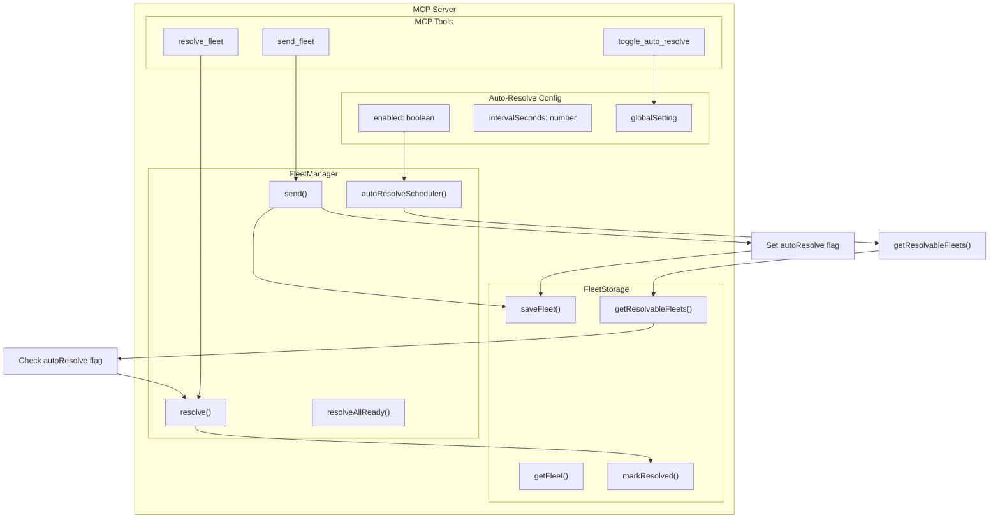

# Automatic Fleet Resolution Feature Plan

## Overview

This feature adds an optional automatic fleet resolution mechanism to the MCP server. While manual resolution via the `resolve_fleet` tool remains available, the server can now automatically resolve fleets when they become ready, significantly simplifying AI agent workflows.

## Current State

- Fleet resolution is currently manual: AI must call `resolve_fleet` after the fleet arrival time + resolve window
- Fleets are tracked in [`PendingFleet`](lobsters/mcp/src/types.ts:79) objects stored in [`FleetStorage`](lobsters/mcp/src/storage/interface.ts:8)
- [`FleetManager.resolveAllReady()`](lobsters/mcp/src/fleet/manager.ts:113) already exists for batch resolution
- [`getResolvableFleets()`](lobsters/mcp/src/fleet/resolve.ts:175) identifies fleets ready for resolution

## Requirements

1. **Global Toggle**: A server-wide setting to enable/disable automatic resolution
2. **Per-Fleet Override**: Ability to mark individual fleets for manual resolution (skip auto-resolution)
3. **Periodic Checking**: Server checks for resolvable fleets at configurable intervals (default: 1 minute)
4. **Toggle Tool**: New MCP tool `toggle_auto_resolve` to enable/disable automatic resolution
5. **Backward Compatibility**: Manual resolution must always remain available

## Architecture



## Data Model Changes

### 1. Update [`PendingFleet`](lobsters/mcp/src/types.ts:79) Type

```typescript
export interface PendingFleet {
  // ... existing fields
  autoResolve?: boolean; // New field: true to auto-resolve, false/undefined to require manual resolution
}
```

### 2. New Configuration Interface

```typescript
export interface AutoResolveConfig {
  enabled: boolean; // Global enable/disable
  intervalSeconds: number; // Check interval (default: 60)
  lastCheckAt?: number; // Timestamp of last check
}
```

### 3. Server Configuration Extension

Add auto-resolution settings to server options in [`createServer()`](lobsters/mcp/src/index.ts:45):

```typescript
export function createServer(
  params: {chain: Chain; privateKey?: `0x${string}`; gameContract: `0x${string}`},
  options?: {
    // ... existing options
    autoResolve?: {
      enabled?: boolean; // Default: false (opt-in)
      intervalSeconds?: number; // Default: 60
    };
  },
);
```

## Component Design

### 1. Auto-Resolution Scheduler

**File**: `lobsters/mcp/src/fleet/auto-resolver.ts`

```typescript
export class AutoResolver {
  private intervalId: NodeJS.Timeout | null = null;
  private config: AutoResolveConfig;

  constructor(
    private fleetManager: FleetManager,
    private storage: FleetStorage,
    config: Partial<AutoResolveConfig> = {},
  ) {
    this.config = {
      enabled: config.enabled ?? false,
      intervalSeconds: config.intervalSeconds ?? 60,
    };
  }

  start(): void {
    if (this.intervalId) return; // Already running

    this.intervalId = setInterval(async () => {
      if (!this.config.enabled) return;
      await this.runResolutionCycle();
    }, this.config.intervalSeconds * 1000);
  }

  stop(): void {
    if (this.intervalId) {
      clearInterval(this.intervalId);
      this.intervalId = null;
    }
  }

  async runResolutionCycle(): Promise<void> {
    // Get resolvable fleets
    // Filter by autoResolve: true (or undefined if global enabled)
    // Resolve each fleet with error handling
    // Log results
  }

  toggle(enabled: boolean): void {
    this.config.enabled = enabled;
  }

  getStatus(): AutoResolveConfig {
    return {...this.config};
  }
}
```

### 2. New Tool: `toggle_auto_resolve`

**File**: `lobsters/mcp/src/tools/toggle-auto-resolve.ts`

```typescript
export const toggleAutoResolveSchema = z.object({
  enabled: z.boolean().describe('Enable or disable automatic fleet resolution'),
});

export async function handleToggleAutoResolve(args: unknown, autoResolver: AutoResolver): Promise<CallToolResult> {
  // Parse args
  // Toggle auto-resolution
  // Return current status
}
```

### 3. Update `send_fleet` Tool

**File**: `lobsters/mcp/src/tools/send-fleet.ts`

Add `autoResolve` parameter to schema:

```typescript
export const sendFleetSchema = z.object({
  from: z.object({x: z.number(), y: z.number()}).describe('Source planet coordinates {x, y}'),
  to: z.object({x: z.number(), y: z.number()}).describe('Destination planet coordinates {x, y}'),
  quantity: z.number().describe('Number of spaceships to send'),
  // ... existing optional params
  autoResolve: z
    .boolean()
    .optional()
    .describe('Whether this fleet should be auto-resolved. If not specified, uses global setting.'),
});
```

Update handler to pass `autoResolve` to fleet manager.

### 4. Update Fleet Manager

**File**: `lobsters/mcp/src/fleet/manager.ts`

Add auto-resolution support:

```typescript
export class FleetManager {
  // ... existing

  private autoResolver: AutoResolver | null = null;

  setAutoResolver(autoResolver: AutoResolver): void {
    this.autoResolver = autoResolver;
  }

  async send(
    fromPlanetId: bigint,
    toPlanetId: bigint,
    quantity: number,
    options?: {
      // ... existing options
      autoResolve?: boolean;
    },
  ): Promise<PendingFleet> {
    // ... existing send logic
    const autoResolve = options?.autoResolve; // Pass to sendFleet
  }
}
```

### 5. Update Storage

**File**: `lobsters/mcp/src/storage/json-storage.ts`

Ensure `autoResolve` field is persisted (should work automatically with current implementation).

## Implementation Steps

1. **Type Definitions**
   - Add `AutoResolveConfig` interface to [`types.ts`](lobsters/mcp/src/types.ts)
   - Add `autoResolve?: boolean` field to `PendingFleet` interface

2. **Auto-Resolver Module**
   - Create `lobsters/mcp/src/fleet/auto-resolver.ts`
   - Implement `AutoResolver` class with scheduler logic
   - Add proper error handling and logging

3. **Toggle Tool**
   - Create `lobsters/mcp/src/tools/toggle-auto-resolve.ts`
   - Implement schema and handler

4. **Update Send Fleet**
   - Modify [`send-fleet.ts`](lobsters/mcp/src/tools/send-fleet.ts) schema
   - Update handler to pass `autoResolve` parameter

5. **Update Fleet Manager**
   - Add `autoResolver` field and `setAutoResolver` method
   - Pass `autoResolve` to `sendFleet` function

6. **Server Integration**
   - Add auto-resolver to [`index.ts`](lobsters/mcp/src/index.ts)
   - Initialize with configuration from options
   - Register `toggle_auto_resolve` tool
   - Start scheduler when enabled

7. **Configuration**
   - Add CLI flags for auto-resolution settings (if applicable)
   - Document environment variables (optional)

8. **Testing**
   - Unit tests for `AutoResolver`
   - Integration tests for auto-resolution flow
   - Test per-fleet override behavior

9. **Documentation**
   - Update README with auto-resolution feature
   - Add examples showing both manual and auto-resolve workflows
   - Document configuration options

## Workflow Examples

### Manual Resolution (Always Available)

```
1. AI calls: acquire_planets(...)
2. AI calls: send_fleet(from, to, quantity)  // autoResolve: false or not set
3. AI waits for arrival + resolve window
4. AI calls: resolve_fleet(fleetId)
5. AI calls: exit_planets(...)
```

### Automatic Resolution (Global Enabled)

```
1. AI calls: toggle_auto_resolve(enabled: true)  // Once at start
2. AI calls: acquire_planets(...)
3. AI calls: send_fleet(from, to, quantity)  // No need for autoResolve param
4. Server automatically resolves fleet when ready
5. AI calls: exit_planets(...)
```

### Automatic Resolution with Manual Override

```
1. AI calls: toggle_auto_resolve(enabled: true)
2. AI calls: acquire_planets(...)
3. AI calls: send_fleet(from, to, quantity, autoResolve: false)  // Specific fleet
4. AI calls: send_fleet(from2, to2, quantity)  // Auto-resolved
5. Server auto-resolves fleet #2
6. AI calls: resolve_fleet(fleetId1)  // Manual resolution for fleet #1
```

## Edge Cases & Considerations

1. **Wallet Required**: Auto-resolution requires wallet client (private key)
2. **Network Errors**: Handle transaction failures gracefully, retry logic
3. **Multiple Fleets**: Batch resolve efficiently, respect gas limits
4. **Race Conditions**: Handle concurrent manual + auto resolution attempts
5. **Persistence**: Ensure auto-resolver state survives server restarts
6. **Logging**: Provide clear logs for debugging auto-resolution actions
7. **Gas Costs**: Auto-resolution may incur gas costs for the operator

## Backward Compatibility

- Manual resolution via `resolve_fleet` remains fully functional
- Existing fleets without `autoResolve` field behave as expected
- Default behavior is manual resolution (opt-in for auto-resolution)
- No breaking changes to existing MCP tools
