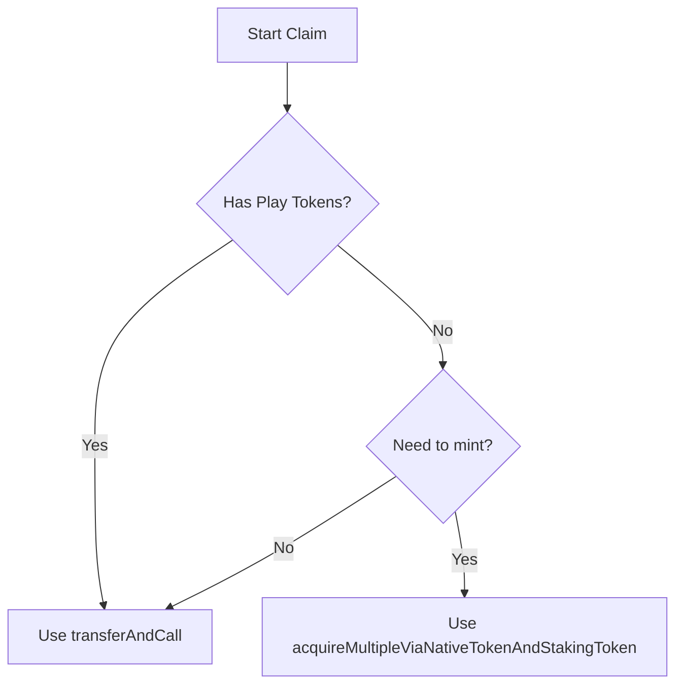
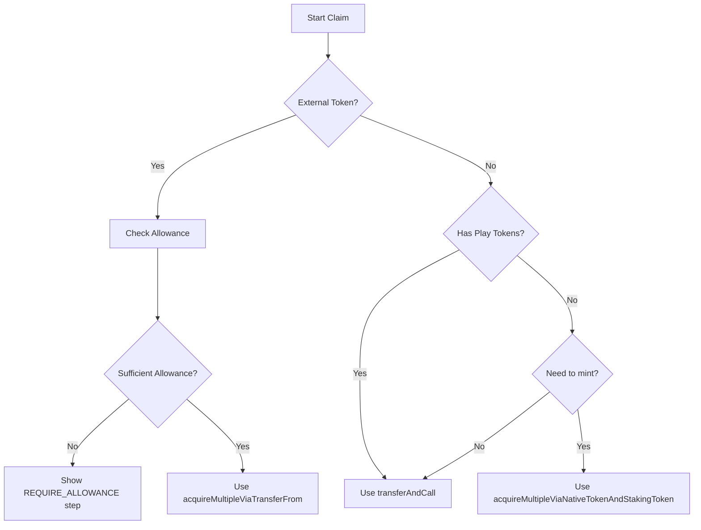

# External Token Support for Web Frontend

## Overview

The Conquest.eth contracts support using external tokens (like existing ERC-20 tokens) as the staking token instead of the built-in mintable PlayToken. When using an external token:

1. **No minting capability**: Users cannot mint new tokens with native tokens
2. **No `transferAndCall`**: External tokens may not support ERC-677 `transferAndCall`
3. **Different acquisition flow**: Must use `acquireViaTransferFrom` or `acquireMultipleViaTransferFrom`
4. **Allowance required**: Users must approve OuterSpace contract to transfer their tokens

## Current Implementation Analysis

### Files to Modify

1. **`web/src/lib/flows/claim.ts`** - Main planet acquisition flow
2. **`web/src/lib/flows/mint.ts`** - Token minting flow (should be disabled for external tokens)
3. **`web/src/lib/blockchain/contracts.ts`** - Contracts info (to expose external token flag)

### Key Differences

| Feature | Mintable PlayToken | External Token |
|---------|-------------------|----------------|
| Mint with native | ✓ `PlayToken.mint()` | ✗ Not available |
| Transfer with callback | ✓ `transferAndCall()` | ✗ Use `transferFrom()` |
| Acquire method | `acquireMultipleViaNativeTokenAndStakingToken()` | `acquireMultipleViaTransferFrom()` |
| Price conversion | Uses `numTokensPerNativeTokenAt18Decimals` | Not applicable |
| Allowance | Optional (can use `transferAndCall`) | **Required** (must approve) |

## Detection of External Token Mode

The `linkedData.numTokensPerNativeTokenAt18Decimals` field:
- **Present and > 0**: Mintable token mode
- **Absent, 0, or undefined**: External token mode

From the deploy script, when `env.tags['external-token']` is true:
- Uses `ExternalToken` artifact instead of `PlayToken`
- Does NOT set `linkedData.numTokensPerNativeTokenAt18Decimals`

## Implementation Plan

### 1. Add External Token Detection Helper

Create a utility function to determine if we're using an external token:

```typescript
// In web/src/lib/blockchain/tokenMode.ts or inline in contracts.ts
export function isExternalToken(): boolean {
  const linkedData = initialContractsInfos.contracts.PlayToken?.linkedData;
  return !linkedData?.numTokensPerNativeTokenAt18Decimals || 
         linkedData.numTokensPerNativeTokenAt18Decimals === '0';
}
```

### 2. Update `claim.ts` - Main Acquisition Flow

**Current Flow:**


**New Flow with External Token:**


**Key Changes to `claim.ts`:**

1. Remove `requireMint` handling for external tokens (lines 374-602)
2. Add new path for external token using `acquireMultipleViaTransferFrom`
3. Ensure allowance is checked and `allowConquestToTransferToken` is available
4. Remove native token calculations that use `numTokensPerNativeTokenAt18Decimals`

### 3. Update `mint.ts` - Disable Minting

When using external tokens:
- Hide or disable the mint flow entirely
- Or show an appropriate error/message

Options:
1. **Best**: Check `isExternalToken()` in the UI component and hide mint button
2. **Alternative**: In `MintFlowStore.mint()`, immediately return with error if external token

### 4. Contract Method Changes

Replace or add alternative paths:

**For External Token:**
```typescript
// Instead of:
outerspaceContract.acquireMultipleViaNativeTokenAndStakingToken(
  locationIds,
  amountToMint,
  tokenAvailable,
  {value: nativeTokenAmount}
)

// Use:
outerspaceContract.acquireMultipleViaTransferFrom(
  locationIds,
  tokenAmount  // Total amount to transfer
)
```

**Allowance:**
```typescript
// Already exists in claim.ts as allowConquestToTransferToken()
// No changes needed to this function
```

### 5. UI Changes Needed

1. **Hide Mint Button**: When `isExternalToken()` is true
2. **Update Stake Selection**: Remove option to "mint more" when external token
3. **Show Token Balance Only**: Don't show "buy tokens" or native token conversion

## Files to Modify

| File | Changes |
|------|---------|
| `web/src/lib/blockchain/contracts.ts` | Add `isExternalToken()` helper |
| `web/src/lib/flows/claim.ts` | Add external token acquisition path |
| `web/src/lib/flows/mint.ts` | Add guard for external token mode |
| UI Components using mint flow | Hide mint button for external tokens |

## Step-by-Step Implementation

### Step 1: Add Token Mode Detection

Add to `web/src/lib/blockchain/contracts.ts`:
```typescript
export function isExternalToken(): boolean {
  const linkedData = _contractsInfos?.contracts?.PlayToken?.linkedData as any;
  return !linkedData?.numTokensPerNativeTokenAt18Decimals || 
         linkedData.numTokensPerNativeTokenAt18Decimals === '0';
}
```

### Step 2: Update claim.ts

1. Import `isExternalToken` function
2. In `confirm()` method, add early check:
```typescript
const externalToken = isExternalToken();

// If external token, skip minting entirely
if (externalToken) {
  // Must have enough tokens in wallet
  const myBalance = get(myTokens).playTokenBalance;
  if (myBalance.lt(tokenAmount)) {
    this.backToWhereYouWere({
      error: new Error(`Insufficient token balance. Need ${formatEther(tokenAmount)} but have ${formatEther(myBalance)}`),
    });
    return;
  }
  
  // Check allowance
  const allowance = await wallet!.contracts.PlayToken.allowance(
    wallet.address,
    wallet!.contracts.OuterSpace.address
  );
  if (allowance.lt(tokenAmount)) {
    this.setPartial({step: 'REQUIRE_ALLOWANCE'});
    return;
  }
  
  // Use acquireMultipleViaTransferFrom
  const gasEstimation = await outerspaceContract.estimateGas.acquireMultipleViaTransferFrom(
    locationIds,
    tokenAmount
  );
  // ... rest of transaction handling
}
```

3. Remove/skip the `requireMint` path when `externalToken` is true

### Step 3: Update mint.ts

Add guard at the start of `mint()` method:
```typescript
async mint(numTokenUnit: number): Promise<void> {
  if (isExternalToken()) {
    this.setPartial({
      step: 'IDLE',
      error: {message: 'Minting is not available when using external tokens'},
    });
    return;
  }
  // ... existing code
}
```

### Step 4: Update UI Components

Find components that:
1. Display mint button - hide when external token
2. Show stake calculation with native tokens - hide conversion for external token
3. Display "buy tokens" option - hide for external token

## Testing Considerations

1. Test with both mintable token and external token deployments
2. Verify allowance flow works correctly
3. Ensure acquisition succeeds with `acquireMultipleViaTransferFrom`
4. Check error handling when balance is insufficient
5. Verify UI hides mint options for external tokens

## Backward Compatibility

- Existing deployments with mintable PlayToken continue to work unchanged
- Detection is automatic based on `linkedData.numTokensPerNativeTokenAt18Decimals`
- No manual configuration needed

## Detailed UI Changes Required

### ClaimFlow.svelte

1. **Hide `nativeTokenAmountFor()` conversions** when external token
   - Line 34-41: The function uses `numTokensPerNativeTokenAt18Decimals`
   - Lines 157, 184, 189, 251, 259, 325: Dollar amounts displayed

2. **Hide mint buttons and related text** when external token
   - Lines 235-291: Entire block for "no tokens" should change
   - Lines 292-368: Partial tokens block should change
   - Messages about "depositing XDAI" and "burning to get XDAI back"

3. **Show different messaging** for external token:
   - "You need X tokens to stake on this planet"
   - "Get tokens from exchange" instead of "mint"
   - No dollar conversion shown

4. **Yakuza**: Not relevant for external tokens - Yakuza is disabled when `numTokensPerNativeTokenAt18Decimals` is not available, so when external token is used, Yakuza won't be deployed. No changes needed.

### EmbeddedMintFlow.svelte

1. Should be entirely hidden or show error when external token

### New Components Needed

None required - can use conditional rendering in existing components

## Implementation Priority

1. **Critical**: `claim.ts` - Add `acquireMultipleViaTransferFrom` path
2. **Critical**: `contracts.ts` - Add `isExternalToken()` helper
3. **High**: `ClaimFlow.svelte` - Hide mint options for external token
4. **Medium**: `mint.ts` - Add guard/disable for external token
5. **Low**: `EmbeddedMintFlow.svelte` - Add guard

## Summary of Code Changes

### contracts.ts
```typescript
// Add helper function
export function isExternalToken(): boolean {
  const linkedData = _contractsInfos?.contracts?.PlayToken?.linkedData as any;
  return !linkedData?.numTokensPerNativeTokenAt18Decimals ||
         linkedData.numTokensPerNativeTokenAt18Decimals === '0';
}
```

### claim.ts confirm() method
```typescript
// Add at start of confirm()
const externalToken = isExternalToken();

// Add new branch for external token path after line 460
if (externalToken) {
  // Check balance
  const myBalance = get(myTokens).playTokenBalance;
  if (myBalance.lt(tokenAmount)) {
    this.backToWhereYouWere({
      error: new Error('Insufficient token balance'),
    });
    return;
  }
  
  // Check allowance
  const allowance = await wallet!.contracts.PlayToken.allowance(
    wallet.address,
    wallet!.contracts.OuterSpace.address
  );
  if (allowance.lt(tokenAmount)) {
    this.setPartial({step: 'REQUIRE_ALLOWANCE'});
    return;
  }
  
  // Use acquireMultipleViaTransferFrom
  let gasEstimation: BigNumber;
  try {
    gasEstimation = await outerspaceContract.estimateGas.acquireMultipleViaTransferFrom(
      locationIds,
      tokenAmount
    );
  } catch (e) {
    this.backToWhereYouWere({error: e});
    return;
  }
  
  const gasLimit = gasEstimation.add(100000);
  
  this.setPartial({step: 'WAITING_TX'});
  
  try {
    tx = await outerspaceContract.acquireMultipleViaTransferFrom(
      locationIds,
      tokenAmount,
      {
        gasLimit,
        maxFeePerGas,
        maxPriorityFeePerGas,
      }
    );
  } catch (e) {
    // ... error handling same as existing
  }
}
```

### ClaimFlow.svelte
```svelte
<script>
  import {isExternalToken} from '$lib/blockchain/contracts';
  
  $: externalToken = isExternalToken();
</script>

<!-- Conditionally hide native token amounts -->
{#if !externalToken}
  <span>worth ${nativeTokenAmountFor(cost)}</span>
{/if}

<!-- Show different UI for external token when no balance -->
{#if externalToken && $myTokens.playTokenBalance.lt(cost.mul('100000000000000'))}
  <div class="text-center">
    <h2>Insufficient Token Balance</h2>
    <p>You need {cost.toNumber() / 10000} tokens to stake on this planet.</p>
    <p>Your balance: {formatEther($myTokens.playTokenBalance)}</p>
  </div>
{:else if ... existing conditions}
```
