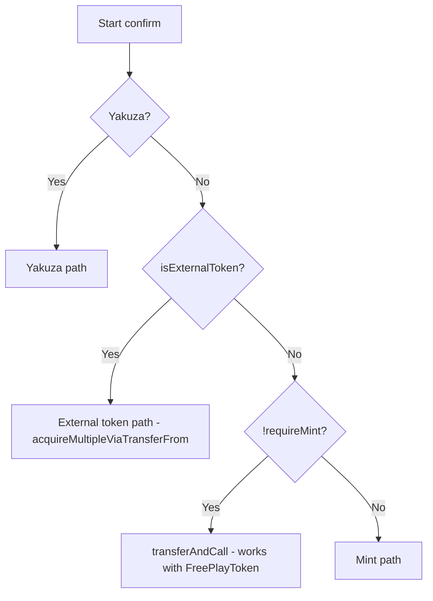
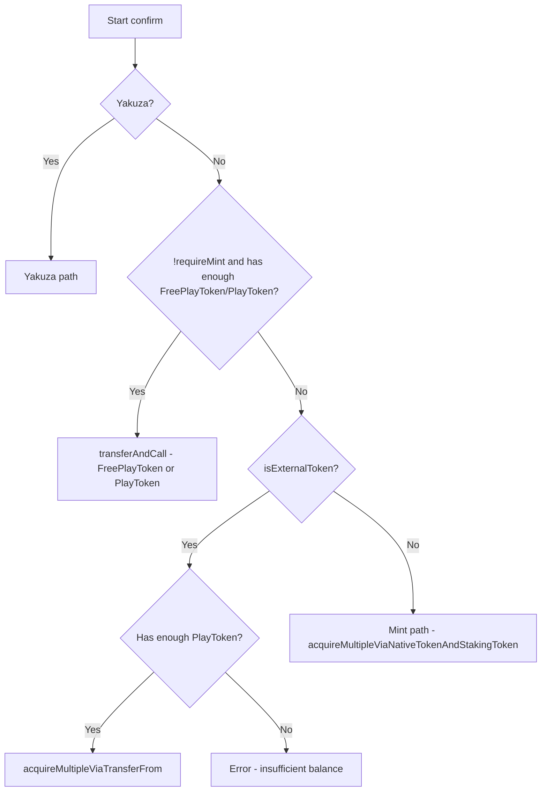

# FreePlayToken Support Fix for External Token Mode

## Problem

The current external token implementation doesn't properly support FreePlayToken. When a deployment uses an external PlayToken (one that cannot be minted), users who have FreePlayToken should still be able to use it via `transferAndCall` since FreePlayToken is always a conquest game token.

## Current Flow Issue



The problem: `isExternalToken()` check happens BEFORE the FreePlayToken `transferAndCall` path, so users with FreePlayToken cannot use it when PlayToken is external.

## Correct Flow



## Files to Modify

### 1. web/src/lib/flows/claim.ts

**Current order at line 460:**
```typescript
} else if (isExternalToken()) {
  // ... external token logic
} else if (!requireMint) {
  // ... transferAndCall logic (supports FreePlayToken)
} else {
  // ... mint logic
}
```

**New order:**
```typescript
} else if (!requireMint) {
  // ... transferAndCall logic (supports FreePlayToken)
  // This path works for BOTH external and mintable PlayToken
  // when user has enough FreePlayToken OR PlayToken
} else if (isExternalToken()) {
  // ... external token logic using acquireMultipleViaTransferFrom
  // Only reached when user doesn't have enough tokens for transferAndCall
  // and minting is not possible
} else {
  // ... mint logic
}
```

### 2. web/src/lib/flows/ClaimFlow.svelte

**Current check at line 238:**
```svelte
{:else if externalToken && $myTokens.playTokenBalance.lt(cost.mul('100000000000000'))}
```

This only checks `playTokenBalance` but should ALSO check `freePlayTokenBalance`:

**New check:**
```svelte
{:else if externalToken && $myTokens.playTokenBalance.lt(cost.mul('100000000000000')) && $myTokens.freePlayTokenBalance.lt(cost.mul('100000000000000'))}
```

This means:
- Show "insufficient balance" error ONLY when BOTH playTokenBalance AND freePlayTokenBalance are insufficient
- If either is sufficient, flow continues to the appropriate existing UI path

## Implementation Steps

### Step 1: Fix claim.ts branch order

Move the `else if (!requireMint)` branch BEFORE the `else if (isExternalToken())` branch.

This ensures:
1. If user calls `confirm()` without `requireMint` (meaning they have enough tokens), the `transferAndCall` path is used
2. The `transferAndCall` path already handles FreePlayToken selection (lines 356-359)
3. The `isExternalToken()` path is only reached when user needs to mint but can't (external token mode with insufficient balance)

### Step 2: Fix ClaimFlow.svelte insufficient balance condition

Update the external token insufficient balance check to consider BOTH token balances.

## Testing Checklist

- [ ] External token + sufficient FreePlayToken → Uses transferAndCall with FreePlayToken
- [ ] External token + sufficient PlayToken (no FreePlayToken) → Uses acquireMultipleViaTransferFrom
- [ ] External token + insufficient both tokens → Shows insufficient balance error
- [ ] Mintable PlayToken + sufficient FreePlayToken → Uses transferAndCall with FreePlayToken
- [ ] Mintable PlayToken + partial tokens → Uses mint path
- [ ] Mintable PlayToken + sufficient PlayToken → Uses transferAndCall with PlayToken
