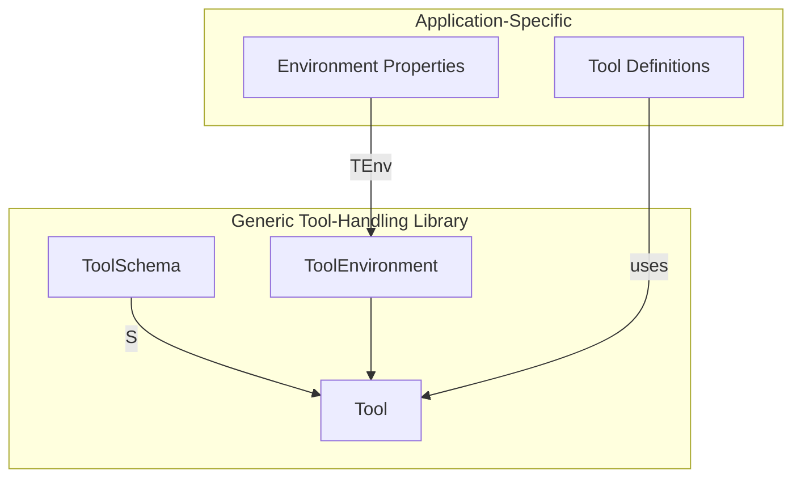

# Plan: Make Tool-Handling Generic Using TypeScript Generics

## Problem
The tool-handling module in [`lobsters/tools/src/tool-handling`](lobsters/tools/src/tool-handling) currently has hard-coded dependencies on [`FleetManager`](lobsters/tools/src/fleet/manager.ts:17) and [`PlanetManager`](lobsters/tools/src/planet/manager.ts:20), making it impossible to extract as a reusable library.

## Current State

### types.ts
```typescript
export type ToolEnvironment = {
    sendStatus: (message: string) => Promise<void>;
    fleetManager: FleetManager;  // ❌ Concrete type
    planetManager: PlanetManager; // ❌ Concrete type
};
```

### index.ts
- [`createToolEnvironment()`](lobsters/tools/src/tool-handling/index.ts:17) returns `ToolEnvironment` with concrete managers
- [`registerTool()`](lobsters/tools/src/tool-handling/index.ts:33) accepts concrete `FleetManager` and `PlanetManager`

### cli-tool-generator.ts
- [`createCliToolEnvironment()`](lobsters/tools/src/tool-handling/cli-tool-generator.ts:208) instantiates concrete managers

## Solution: Generic Approach

### 1. Define Generic ToolEnvironment

The managers are spread directly into the environment object for direct access (e.g., `env.fleetManager`):

```typescript
export type ToolEnvironment<TEnv extends Record<string, any> = {}> = {
    sendStatus: (message: string) => Promise<void>;
} & TEnv;
```

### 2. Update Tool Type to Use Generic Environment

```typescript
export type Tool<S extends ToolSchema = z.ZodObject<any>, TEnv extends Record<string, any> = {}> = {
    description: string;
    schema: S;
    execute: (env: ToolEnvironment<TEnv>, params: z.infer<S>) => Promise<ToolResult>;
};
```

### 3. Update createTool Helper Function

```typescript
export function createTool<S extends ToolSchema, TEnv extends Record<string, any>>(config: {
    description: string;
    schema: S;
    execute: (env: ToolEnvironment<TEnv>, params: z.infer<S>) => Promise<ToolResult>;
}): Tool<S, TEnv>;
```

### 4. Update registerTool to Be Generic

Accepts environment properties and merges them with sendStatus:

```typescript
export function registerTool<TEnv extends Record<string, any>, S extends ToolSchema>({
    server,
    name,
    tool,
    env,
}: {
    server: McpServer;
    name: string;
    tool: Tool<S, TEnv>;
    env: TEnv;
}): void;
```

### 5. Update createToolEnvironment (index.ts)

Generic function that accepts environment properties:

```typescript
export function createToolEnvironment<TEnv extends Record<string, any>>(
    server: McpServer,
    env: TEnv,
): ToolEnvironment<TEnv>;
```

### 6. Update CliConfig and createCliToolEnvironment (cli-tool-generator.ts)

Make CliConfig generic but without a typed config - the library doesn't need to know about CLI-specific options:

```typescript
export interface CliConfig<TEnv> {
    // Factory function that creates environment from parsed CLI options
    // The options are passed as Record<string, any> - user can cast to their config type
    envFactory: (cliOptions: Record<string, any>) => Promise<TEnv> | TEnv;
}

async function createCliToolEnvironment<TEnv>(
    config: CliConfig<TEnv>,
    cliOptions: Record<string, any>
): Promise<ToolEnvironment<TEnv>>;
```

### 7. Update generateToolCommand to Be Generic

```typescript
export function generateToolCommand<TEnv extends Record<string, any>>(
    program: Command,
    toolName: string,
    tool: Tool<z.ZodObject<any>, TEnv>,
    cliConfig: CliConfig<TEnv>,
): void;
```

### 8. Update registerAllToolCommands to Be Generic

```typescript
export function registerAllToolCommands<TEnv extends Record<string, any>>(
    program: Command,
    tools: Record<string, Tool<any, TEnv>>,
    cliConfig: CliConfig<TEnv>,
): void;
```

## Architecture Diagram



## Migration Strategy

1. **Phase 1**: Update types.ts with generic `TEnv` type parameter
2. **Phase 2**: Update index.ts to support generic environment registration
3. **Phase 3**: Update cli-tool-generator.ts to accept envFactory function
4. **Phase 4**: Update all existing tool definitions to use new generic API

## Benefits

1. ✅ **Reusable as a library**: No application-specific dependencies
2. ✅ **Type-safe**: Full TypeScript type inference
3. ✅ **Flexible**: Can use any environment/manager implementation
4. ✅ **Extensible**: Easy to add new environment properties

## File Changes Required

| File | Changes |
|------|---------|
| [`types.ts`](lobsters/tools/src/tool-handling/types.ts) | Add generic `TEnv` type parameter to Tool, ToolEnvironment, createTool |
| [`index.ts`](lobsters/tools/src/tool-handling/index.ts) | Make createToolEnvironment and registerTool generic over TEnv |
| [`cli-tool-generator.ts`](lobsters/tools/src/tool-handling/cli-tool-generator.ts) | Make CliConfig (TEnv only), createCliToolEnvironment, generateToolCommand, and registerAllToolCommands generic |

## Example Usage (After Refactor)

### Define Environment Type
```typescript
interface GameEnv = {
    fleetManager: FleetManager;
    planetManager: PlanetManager;
}
```

### Define Application-Specific CLI Config Type (outside the library)
```typescript
interface GameCliOptions {
    rpcUrl: string;
    privateKey?: `0x${string}`;
    gameContract: `0x${string}`;
    storageType: 'json' | 'sqlite';
    storagePath: string;
}
```

### Create a Generic Tool
```typescript
const sendFleetTool = createTool<GameEnv>({
    description: "Send a fleet to a destination planet",
    schema: z.object({
        fromPlanetId: z.bigint(),
        toPlanetId: z.bigint(),
        quantity: z.number(),
    }),
    execute: async (env, params) => {
        const {fleetManager} = env;
        const result = await fleetManager.send(
            params.fromPlanetId,
            params.toPlanetId,
            params.quantity
        );
        return {success: true, result};
    }
});
```

### Register with MCP Server
```typescript
registerTool({
    server: mcpServer,
    name: "send_fleet",
    tool: sendFleetTool,
    env: {
        fleetManager,
        planetManager,
    },
});
```

### CLI Usage with envFactory
```typescript
// Application-specific envFactory
const envFactory = async (cliOptions: Record<string, any>): Promise<GameEnv> => {
    const options = cliOptions as GameCliOptions;
    
    const chain = await getChain(options.rpcUrl);
    const clients = getClients({
        chain,
        privateKey: options.privateKey
    }) as ClientsWithOptionalWallet;
    
    const gameContract: GameContract = {
        address: options.gameContract,
        abi: Abi_IOuterSpace,
    };
    
    const {spaceInfo, contractConfig} = await createSpaceInfo(clients, gameContract);
    const storage = new JsonFleetStorage(options.storagePath);
    
    return {
        fleetManager: new FleetManager(clients, gameContract, spaceInfo, contractConfig, storage),
        planetManager: new PlanetManager(clients, gameContract, spaceInfo, contractConfig, storage),
    };
};

// In CLI action handler:
const env = await createCliToolEnvironment(
    { envFactory },
    cliOptions  // Parsed commander.js options
);

const result = await tool.execute(env, validatedParams);
```