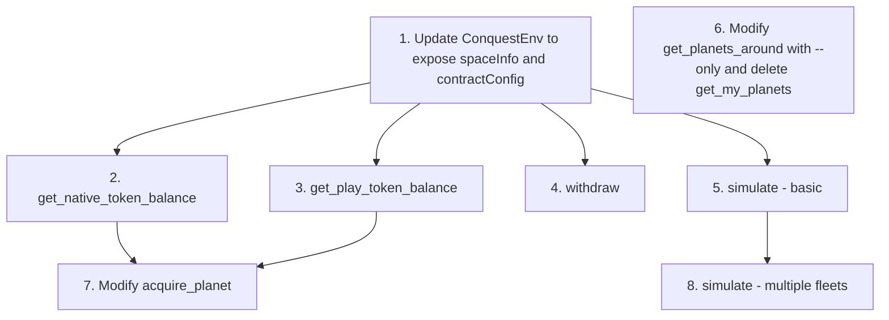

# Lobsters Tools Implementation Plan

This document outlines the implementation plan for the important TODOs from [`lobsters/tools/TODO.md`](lobsters/tools/TODO.md).

## Overview

The following tools need to be added or modified in the [`lobsters/tools/src/tools/`](lobsters/tools/src/tools/) directory. Each tool follows the existing pattern using `createTool` with Zod schemas for validation.

**Note:** The SpaceInfo class and types are imported from `conquest-eth-v0-contracts` package (source: [`contracts/js/model/SpaceInfo.ts`](contracts/js/model/SpaceInfo.ts)).

---

## 1. Add Tool: `simulate`

**Purpose:** Estimate the outcome of a fleet attack using the existing [`outcome()`](contracts/js/model/SpaceInfo.ts:629) method in SpaceInfo.

### Implementation Details

**File:** `lobsters/tools/src/tools/simulate.ts`

**Schema Parameters:**
- `from`: `{x: number, y: number}` - Source planet coordinates
- `to`: `{x: number, y: number}` - Target planet coordinates
- `quantity`: `number` - Number of spaceships to send

**Logic Flow:**
1. Get planet info for both source and target using [`getPlanetInfo()`](lobsters/tools/src/planet/manager.ts:119)
2. Fetch current state of target planet from contract via [`getPlanetsAround()`](lobsters/tools/src/planet/manager.ts:145)
3. Calculate travel time using [`timeToArrive()`](contracts/js/model/SpaceInfo.ts:329)
4. Use [`outcome()`](contracts/js/model/SpaceInfo.ts:629) method from SpaceInfo to simulate the attack
5. Return min/max outcomes including:
   - Whether capture is successful
   - Number of spaceships left
   - Time until attack fails (if applicable)
   - Combat losses

**Key SpaceInfo Methods (from `conquest-eth-v0-contracts`):**
- [`outcome()`](contracts/js/model/SpaceInfo.ts:629) - Simulates combat outcome with min/max results
- [`combat()`](contracts/js/model/SpaceInfo.ts:903) - Core combat calculation
- [`timeToArrive()`](contracts/js/model/SpaceInfo.ts:329) - Calculate travel time between planets
- [`simulateCapture()`](contracts/js/model/SpaceInfo.ts:957) - Simulate planet acquisition

**Dependencies:**
- Requires access to SpaceInfo instance (available via FleetManager or PlanetManager)
- Need to expose SpaceInfo in ConquestEnv or through managers

**Changes Required:**
1. Create new file: `lobsters/tools/src/tools/simulate.ts`
2. Export from [`lobsters/tools/src/tools/index.ts`](lobsters/tools/src/tools/index.ts:1)
3. May need to expose SpaceInfo in ConquestEnv type

---

## 2. Modify Tool: Merge `get_my_planets` into `get_planets_around`

**Purpose:** Add `--only` argument to filter planets by owner address.

### Implementation Details

**File:** Modify [`lobsters/tools/src/tools/get_planets_around.ts`](lobsters/tools/src/tools/get_planets_around.ts)

**Schema Changes:**
Add new optional parameter:
```typescript
only: z.string()
  .optional()
  .describe('Filter by owner: use "me" for current wallet address, or provide an address')
```

**Logic Flow:**
1. After fetching planets, filter by owner if `only` is provided
2. If `only === "me"`:
   - Require wallet client (private key)
   - Filter planets where `state.owner` matches current wallet address
3. If `only` is an address:
   - Filter planets where `state.owner` matches the provided address
4. Return filtered results

**Cleanup:**
- Remove `get_my_planets.ts` entirely
- Remove export from `index.ts`

**Files to Modify:**
1. [`lobsters/tools/src/tools/get_planets_around.ts`](lobsters/tools/src/tools/get_planets_around.ts)
2. [`lobsters/tools/src/tools/index.ts`](lobsters/tools/src/tools/index.ts) - Remove get_my_planets export
3. Delete [`lobsters/tools/src/tools/get_my_planets.ts`](lobsters/tools/src/tools/get_my_planets.ts)

---

## 3. Add Tool: `get_native_token_balance`

**Purpose:** Get the native token (ETH) balance for an address.

### Implementation Details

**File:** `lobsters/tools/src/tools/get_native_token_balance.ts`

**Schema Parameters:**
- `address`: `string` (optional) - Address to check balance for. Defaults to current wallet if private key available.

**Logic Flow:**
1. If no address provided:
   - Require wallet client (private key must be set)
   - Use current wallet address
2. Call `publicClient.getBalance({ address })`
3. Return balance in ETH (formatted from wei)

**Return Value:**
```typescript
{
  address: string,
  balance: string,  // Human readable (e.g., "1.5 ETH")
  balanceWei: string  // Raw wei value
}
```

**Files to Create:**
1. `lobsters/tools/src/tools/get_native_token_balance.ts`
2. Update [`lobsters/tools/src/tools/index.ts`](lobsters/tools/src/tools/index.ts)

---

## 4. Add Tool: `get_play_token_balance`

**Purpose:** Get the play token (staking token) balance for an address.

### Implementation Details

**File:** `lobsters/tools/src/tools/get_play_token_balance.ts`

**Schema Parameters:**
- `address`: `string` (optional) - Address to check balance for. Defaults to current wallet if private key available.

**Logic Flow:**
1. If no address provided:
   - Require wallet client (private key must be set)
   - Use current wallet address
2. Get staking token address from [`contractConfig.stakingToken`](lobsters/tools/src/types.ts:57)
3. Call ERC20 `balanceOf` on the staking token contract
4. Format balance using token decimals (18 decimals per the contract)

**Return Value:**
```typescript
{
  address: string,
  tokenAddress: string,
  balance: string,  // Human readable
  balanceRaw: string  // Raw value
}
```

**Dependencies:**
- Need to add ERC20 balanceOf ABI
- Access to contractConfig via managers

**Files to Create/Modify:**
1. `lobsters/tools/src/tools/get_play_token_balance.ts`
2. Add ERC20 ABI for balanceOf to [`lobsters/tools/src/contracts/space-info.ts`](lobsters/tools/src/contracts/space-info.ts) or new file
3. Update [`lobsters/tools/src/tools/index.ts`](lobsters/tools/src/tools/index.ts)
4. May need to expose contractConfig in ConquestEnv

---

## 5. Modify Tool: `acquire_planet` - Remove Args, Use Max Balance

**Purpose:** Simplify planet acquisition by automatically using all available play token balance first, then minting the remainder with native tokens.

### Implementation Details

**File:** Modify [`lobsters/tools/src/tools/acquire_planets.ts`](lobsters/tools/src/tools/acquire_planets.ts)

**Schema Changes:**
- Remove `amountToMint` parameter
- Remove `tokenAmount` parameter
- Keep only `coordinates` array

**Logic Flow:**
1. Calculate required token amount based on planet stats (existing [`calculateAcquisitionCosts()`](lobsters/tools/src/planet/manager.ts:85))
2. Check current play token balance
3. Use ALL available play token balance first
4. Calculate remaining amount needed: `amountToMint = requiredAmount - playTokenBalance`
5. If remaining > 0, mint that amount using native tokens
6. Call `acquireMultipleViaNativeTokenAndStakingToken(locations, amountToMint, tokenAmount)`
   - Where `tokenAmount` = user's full play token balance
   - Where `amountToMint` = remaining amount to mint

**Example:**
- Planet costs 5 tokens
- User has 3 play tokens
- Action: Use all 3 tokens + mint 2 with native tokens

**Files to Modify:**
1. [`lobsters/tools/src/tools/acquire_planets.ts`](lobsters/tools/src/tools/acquire_planets.ts)
2. [`lobsters/tools/src/planet/acquire.ts`](lobsters/tools/src/planet/acquire.ts) - May need new method
3. [`lobsters/tools/src/planet/manager.ts`](lobsters/tools/src/planet/manager.ts) - Add balance checking and smart acquisition method

---

## 6. Add Tool: `withdraw`

**Purpose:** Claim successful exits and withdraw tokens using [`fetchAndWithdrawFor`](contracts/src/outerspace/interfaces/IOuterSpaceStaking.sol:46).

### Implementation Details

**File:** `lobsters/tools/src/tools/withdraw.ts`

**Schema Parameters:**
- `coordinates`: Array of `{x: number, y: number}` - Planets to withdraw from

**Logic Flow:**
1. Convert coordinates to planet location IDs
2. Get current wallet address
3. Call contract function [`fetchAndWithdrawFor(owner, locations[])`](contracts/src/outerspace/interfaces/IOuterSpaceStaking.sol:46)
4. Return transaction hash and withdrawn amount

**Contract Function Signature:**
```solidity
function fetchAndWithdrawFor(
    address owner,
    uint256[] calldata locations
) external;
```

**Return Value:**
```typescript
{
  transactionHash: string,
  coordinates: {x: number, y: number}[],
  success: boolean
}
```

**Files to Create:**
1. `lobsters/tools/src/tools/withdraw.ts`
2. May need to add withdraw method to PlanetManager
3. Update [`lobsters/tools/src/tools/index.ts`](lobsters/tools/src/tools/index.ts)

---

## 7. Modify Tool: `simulate` - Multiple Fleets

**Purpose:** Extend simulate tool to support multiple fleets from different planets arriving at the same time.

### Implementation Details

**File:** Modify `lobsters/tools/src/tools/simulate.ts` (after initial implementation)

**Schema Changes:**
Replace single fleet parameters with array:
```typescript
fleets: z.array(z.object({
  from: z.object({x: z.number(), y: z.number()}),
  quantity: z.number()
})),
to: z.object({x: z.number(), y: z.number()}),
arrivalTime: z.number().optional()  // Specific arrival time, or calculate from slowest fleet
```

**Logic Flow:**
1. For each fleet, calculate travel time
2. Determine arrival time (use provided or max of all travel times)
3. Sequentially simulate each fleet's attack on target, updating state after each
4. Use the SpaceInfo [`outcome()`](contracts/js/model/SpaceInfo.ts:629) method for each fleet
5. Aggregate results showing contribution of each fleet

**Return Value:**
```typescript
{
  arrivalTime: number,
  fleets: Array<{
    from: {x, y},
    quantity: number,
    outcome: Outcome
  }>,
  finalOutcome: {
    captured: boolean,
    numSpaceshipsLeft: number
  }
}
```

**Dependencies:**
- Requires initial simulate tool implementation first
- May need additional SpaceInfo methods for sequential combat simulation

---

## Architecture Considerations

### Exposing SpaceInfo and ContractConfig

Several tools need access to `SpaceInfo` (from `conquest-eth-v0-contracts`) and `contractConfig`.

**Decision: Add SpaceInfo to ConquestEnv**

Update [`lobsters/tools/src/types.ts`](lobsters/tools/src/types.ts:25):
```typescript
import type {SpaceInfo} from 'conquest-eth-v0-contracts';

interface ConquestEnv {
  fleetManager: FleetManager;
  planetManager: PlanetManager;
  spaceInfo: SpaceInfo;  // Add this - from conquest-eth-v0-contracts
  contractConfig: ContractConfig;  // Add this
  options: EnvFactoryOptions;
}
```

Update [`lobsters/tools/src/index.ts`](lobsters/tools/src/index.ts:22) `createConquestEnv()`:
```typescript
return {
  fleetManager: new FleetManager(clients, gameContract, spaceInfo, contractConfig, storage),
  planetManager: new PlanetManager(clients, gameContract, spaceInfo, contractConfig, storage),
  spaceInfo,  // Add this
  contractConfig,  // Add this
  options,
};
```

### Files Summary

| File | Action | Description |
|------|--------|-------------|
| `simulate.ts` | Create | Fleet attack simulation tool |
| `get_planets_around.ts` | Modify | Add --only filter parameter |
| `get_my_planets.ts` | Delete | Remove entirely, functionality merged into get_planets_around |
| `get_native_token_balance.ts` | Create | Native token balance check |
| `get_play_token_balance.ts` | Create | Play token balance check |
| `acquire_planets.ts` | Modify | Remove manual amount args, auto-calculate |
| `withdraw.ts` | Create | Withdraw tokens from exited planets |
| `index.ts` | Modify | Export new tools, remove get_my_planets export |
| `types.ts` | Modify | May need to update ConquestEnv interface |
| `index.ts` (root) | Modify | Expose spaceInfo and contractConfig |

---

## Implementation Order

The recommended implementation order based on dependencies:



1. **Update ConquestEnv** - Foundation for other tools
2. **get_native_token_balance** - Simple, no other dependencies
3. **get_play_token_balance** - Needs contractConfig
4. **withdraw** - Independent feature
5. **simulate (basic)** - Needs SpaceInfo
6. **Modify get_planets_around & delete get_my_planets** - Independent refactoring
7. **Modify acquire_planet** - Needs balance tools
8. **simulate (multiple fleets)** - Builds on basic simulate

---

## Testing Considerations

Each new/modified tool should have corresponding tests in `lobsters/tools/test/`:

- Unit tests for logic
- Integration tests with mock contract calls
- CLI tests following pattern in [`lobsters/tools/test/cli/`](lobsters/tools/test/cli/)
