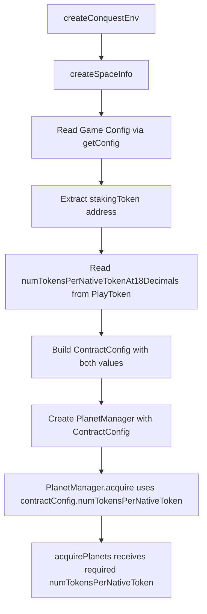

# Plan: Make numTokensPerNativeToken Required and Fetch from PlayToken Contract

## Overview

Currently in [`lobsters/tools/src/planet/acquire.ts`](lobsters/tools/src/planet/acquire.ts:20), the `numTokensPerNativeToken` parameter is optional with a default value of `1000000000000000000n` (1:1 ratio). This should be fetched from the PlayToken contract instead.

## Current State

### Problem
- [`acquirePlanets()`](lobsters/tools/src/planet/acquire.ts:14) has an optional `numTokensPerNativeToken` parameter
- The manager doesn't have access to this value from the contract
- The default value may not match the actual contract configuration

### Contract Details
- The game contract's [`getConfig()`](contracts/src/outerspace/facets/OuterSpaceInformationFacet.sol:18) returns a `stakingToken` address
- The [`PlayToken`](contracts/src/conquest_token/PlayToken.sol:36) contract has a public immutable `numTokensPerNativeTokenAt18Decimals` variable

## Implementation Steps

### Step 1: Update ContractConfig Type

**File:** [`lobsters/tools/src/types.ts`](lobsters/tools/src/types.ts:51)

Add new fields to the `ContractConfig` interface:

```typescript
export interface ContractConfig {
  genesis: bigint;
  resolveWindow: bigint;
  timePerDistance: bigint;
  exitDuration: bigint;
  acquireNumSpaceships: number;
  stakingToken: `0x${string}`;  // NEW: PlayToken contract address
  numTokensPerNativeToken: bigint;  // NEW: Fetched from PlayToken
  [key: string]: bigint | number | `0x${string}`;  // Update index signature
}
```

### Step 2: Update createSpaceInfo to Fetch numTokensPerNativeToken

**File:** [`lobsters/tools/src/contracts/space-info.ts`](lobsters/tools/src/contracts/space-info.ts:4)

1. After fetching the game config, extract the `stakingToken` address
2. Read `numTokensPerNativeTokenAt18Decimals` from the PlayToken contract
3. Include both values in the returned `contractConfig`

```typescript
// After getting game config
const stakingTokenAddress = config.stakingToken as `0x${string}`;

// Fetch numTokensPerNativeToken from PlayToken contract
const numTokensPerNativeToken = await clients.publicClient.readContract({
  address: stakingTokenAddress,
  abi: [
    {
      name: 'numTokensPerNativeTokenAt18Decimals',
      type: 'function',
      stateMutability: 'view',
      inputs: [],
      outputs: [{ type: 'uint256' }],
    },
  ] as const,
  functionName: 'numTokensPerNativeTokenAt18Decimals',
});

const contractConfig: ContractConfig = {
  // existing fields...
  stakingToken: stakingTokenAddress,
  numTokensPerNativeToken: BigInt(numTokensPerNativeToken),
};
```

### Step 3: Update PlanetManager Constructor

**File:** [`lobsters/tools/src/planet/manager.ts`](lobsters/tools/src/planet/manager.ts:20)

No changes needed to the constructor since `contractConfig` is already passed in. The `numTokensPerNativeToken` will be accessible via `this.contractConfig.numTokensPerNativeToken`.

### Step 4: Update acquirePlanets Function Signature

**File:** [`lobsters/tools/src/planet/acquire.ts`](lobsters/tools/src/planet/acquire.ts:14)

Make `numTokensPerNativeToken` a required parameter without a default:

```typescript
export async function acquirePlanets(
  clients: Clients,
  gameContract: GameContract,
  planetIds: bigint[],
  amountToMint: bigint,
  tokenAmount: bigint,
  numTokensPerNativeToken: bigint,  // REQUIRED, no default
): Promise<{hash: `0x${string}`; planetsAcquired: bigint[]}> {
```

### Step 5: Update PlanetManager.acquire Methods

**File:** [`lobsters/tools/src/planet/manager.ts`](lobsters/tools/src/planet/manager.ts:44)

Update the `acquire()` and `acquireWithAutoCalc()` methods to pass the `numTokensPerNativeToken` from `contractConfig`:

```typescript
async acquire(
  planetIds: bigint[],
  amountToMint: bigint,
  tokenAmount: bigint,
): Promise<{hash: `0x${string}`; planetsAcquired: bigint[]}> {
  return acquirePlanets(
    this.requireWalletClient(),
    this.gameContract,
    planetIds,
    amountToMint,
    tokenAmount,
    this.contractConfig.numTokensPerNativeToken,  // NEW
  );
}

async acquireWithAutoCalc(planetIds: bigint[]): Promise<{...}> {
  const costs = this.calculateAcquisitionCosts(planetIds);
  const result = await acquirePlanets(
    this.requireWalletClient(),
    this.gameContract,
    planetIds,
    costs.amountToMint,
    costs.tokenAmount,
    this.contractConfig.numTokensPerNativeToken,  // NEW
  );
  return {...result, costs};
}
```

## Data Flow Diagram



## Files to Modify

| File | Change |
|------|--------|
| [`lobsters/tools/src/types.ts`](lobsters/tools/src/types.ts) | Add `stakingToken` and `numTokensPerNativeToken` to `ContractConfig` |
| [`lobsters/tools/src/contracts/space-info.ts`](lobsters/tools/src/contracts/space-info.ts) | Fetch `numTokensPerNativeToken` from PlayToken contract |
| [`lobsters/tools/src/planet/acquire.ts`](lobsters/tools/src/planet/acquire.ts) | Make `numTokensPerNativeToken` required parameter |
| [`lobsters/tools/src/planet/manager.ts`](lobsters/tools/src/planet/manager.ts) | Pass `numTokensPerNativeToken` to `acquirePlanets` |

## Testing Considerations

1. Update existing tests that call `acquirePlanets` directly to pass the required parameter
2. Integration tests should verify the value is correctly fetched from the contract
3. Consider adding a test that verifies the calculation matches expected results

## Notes

- The PlayToken contract uses the name `numTokensPerNativeTokenAt18Decimals` while the internal variable/config can use `numTokensPerNativeToken` for brevity
- The value is immutable in the contract, so it can be safely cached at initialization time
- No changes needed to the acquire_planets tool as it uses the manager which handles this internally
