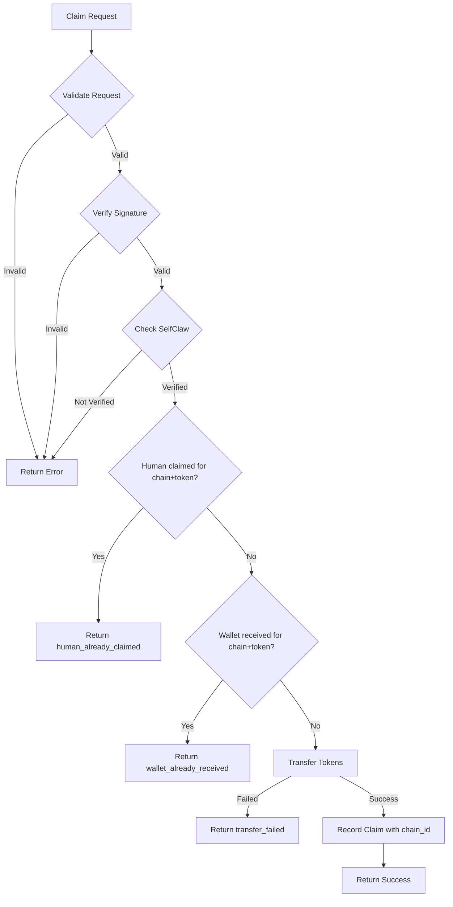

# Plan: Per-Chain/Token Claim Uniqueness

## Overview

Update the `selfclaw-claims` service to allow users to claim once per unique `(chain_id + token_address)` combination instead of a global one-time claim.

## Current State

### Database Schema ([`0001_create_claims.sql`](../helper-services/selfclaw-claims/migrations/0001_create_claims.sql))
- `human_id TEXT NOT NULL UNIQUE` - Global uniqueness
- `wallet_address TEXT NOT NULL UNIQUE` - Global uniqueness
- No `chain_id` column stored

### Claim Logic ([`database.ts`](../helper-services/selfclaw-claims/src/services/claim/database.ts))
- [`hasHumanClaimed()`](../helper-services/selfclaw-claims/src/services/claim/database.ts:17-26) checks if humanId exists anywhere
- [`hasWalletReceived()`](../helper-services/selfclaw-claims/src/services/claim/database.ts:35-44) checks if wallet exists anywhere

## Target State

Allow the same human/wallet to claim on different chain+token combinations, but only once per combination.

---

## Implementation Plan

### 1. Update Existing Database Schema

Modify the existing migration file `migrations/0001_create_claims.sql`:

```sql
-- Token Claims Table
-- Tracks ERC20 token distributions to verified SelfClaw humans
-- Uniqueness is scoped to (human_id, chain_id, token_address) and (wallet_address, chain_id, token_address)

CREATE TABLE IF NOT EXISTS token_claims (
    id INTEGER PRIMARY KEY AUTOINCREMENT,
    human_id TEXT NOT NULL,
    wallet_address TEXT NOT NULL,
    public_key TEXT NOT NULL,
    tx_hash TEXT NOT NULL,
    amount TEXT NOT NULL,
    token_address TEXT NOT NULL,
    chain_id TEXT NOT NULL,
    claimed_at INTEGER NOT NULL,
    created_at INTEGER NOT NULL DEFAULT (strftime('%s', 'now') * 1000)
);

-- Composite unique indexes for per-chain-token uniqueness
CREATE UNIQUE INDEX IF NOT EXISTS idx_token_claims_human_chain_token 
    ON token_claims(human_id, chain_id, token_address);

CREATE UNIQUE INDEX IF NOT EXISTS idx_token_claims_wallet_chain_token 
    ON token_claims(wallet_address, chain_id, token_address);

-- Index for looking up by chain and token
CREATE INDEX IF NOT EXISTS idx_token_claims_chain_token 
    ON token_claims(chain_id, token_address);
```

**Key changes:**
- Removed `UNIQUE` constraint from `human_id` and `wallet_address` columns
- Added `chain_id TEXT NOT NULL` column
- Added composite unique indexes: `(human_id, chain_id, token_address)` and `(wallet_address, chain_id, token_address)`

### 2. Update Database Functions ([`database.ts`](../helper-services/selfclaw-claims/src/services/claim/database.ts))

#### 2.1 Update [`hasHumanClaimed()`](../helper-services/selfclaw-claims/src/services/claim/database.ts:17-26)
```typescript
export async function hasHumanClaimed(
  db: RemoteSQL,
  humanId: string,
  chainId: string,
  tokenAddress: string,
): Promise<boolean> {
  const result = await db
    .prepare(
      "SELECT 1 FROM token_claims WHERE human_id = ? AND chain_id = ? AND token_address = ?"
    )
    .bind(humanId.toLowerCase(), chainId, tokenAddress.toLowerCase())
    .all();
  return result.results.length > 0;
}
```

#### 2.2 Update [`hasWalletReceived()`](../helper-services/selfclaw-claims/src/services/claim/database.ts:35-44)
```typescript
export async function hasWalletReceived(
  db: RemoteSQL,
  walletAddress: string,
  chainId: string,
  tokenAddress: string,
): Promise<boolean> {
  const result = await db
    .prepare(
      "SELECT 1 FROM token_claims WHERE wallet_address = ? AND chain_id = ? AND token_address = ?"
    )
    .bind(walletAddress.toLowerCase(), chainId, tokenAddress.toLowerCase())
    .all();
  return result.results.length > 0;
}
```

#### 2.3 Update [`recordClaim()`](../helper-services/selfclaw-claims/src/services/claim/database.ts:52-72)
Add `chainId` to the INSERT statement:
```typescript
export async function recordClaim(
  db: RemoteSQL,
  claim: ClaimRecord,
): Promise<void> {
  await db
    .prepare(
      `INSERT INTO token_claims 
        (human_id, wallet_address, public_key, tx_hash, amount, token_address, chain_id, claimed_at) 
        VALUES (?, ?, ?, ?, ?, ?, ?, ?)`
    )
    .bind(
      claim.humanId.toLowerCase(),
      claim.walletAddress.toLowerCase(),
      claim.publicKey,
      claim.txHash,
      claim.amount,
      claim.tokenAddress.toLowerCase(),
      claim.chainId,
      claim.claimedAt,
    )
    .all();
}
```

#### 2.4 Update [`getClaimStatus()`](../helper-services/selfclaw-claims/src/services/claim/database.ts:81-114)
Add optional `chainId` and `tokenAddress` parameters for scoped status:
```typescript
export async function getClaimStatus(
  db: RemoteSQL,
  humanId: string,
  chainId?: string,
  tokenAddress?: string,
): Promise<StatusResponse> {
  let query = "SELECT wallet_address, tx_hash, claimed_at, chain_id, token_address FROM token_claims WHERE human_id = ?";
  const params: string[] = [humanId.toLowerCase()];
  
  if (chainId && tokenAddress) {
    query += " AND chain_id = ? AND token_address = ?";
    params.push(chainId, tokenAddress.toLowerCase());
  }

  const result = await db
    .prepare(query)
    .bind(...params)
    .all<{
      wallet_address: string;
      tx_hash: string;
      claimed_at: number;
      chain_id: string;
      token_address: string;
    }>();

  if (result.results.length === 0) {
    return {
      humanId,
      claimed: false,
    };
  }

  // Return first result for scoped query, or all claims for unscoped
  const row = result.results[0];
  return {
    humanId,
    claimed: true,
    claim: {
      walletAddress: row.wallet_address,
      txHash: row.tx_hash,
      claimedAt: row.claimed_at,
    },
  };
}
```

#### 2.5 Update [`getClaimByWallet()`](../helper-services/selfclaw-claims/src/services/claim/database.ts:123-162)
Add `chainId` and `tokenAddress` parameters:
```typescript
export async function getClaimByWallet(
  db: RemoteSQL,
  walletAddress: string,
  chainId?: string,
  tokenAddress?: string,
): Promise<ClaimRecord | null> {
  let query = `SELECT id, human_id, wallet_address, public_key, tx_hash, amount, token_address, chain_id, claimed_at, created_at 
      FROM token_claims WHERE wallet_address = ?`;
  const params: string[] = [walletAddress.toLowerCase()];
  
  if (chainId && tokenAddress) {
    query += " AND chain_id = ? AND token_address = ?";
    params.push(chainId, tokenAddress.toLowerCase());
  }

  const result = await db
    .prepare(query)
    .bind(...params)
    .all<{...}>();

  // ... rest of implementation
}
```

### 3. Update Types ([`types.ts`](../helper-services/selfclaw-claims/src/services/claim/types.ts))

#### 3.1 Update [`ClaimRecord`](../helper-services/selfclaw-claims/src/services/claim/types.ts:68-78)
```typescript
export interface ClaimRecord {
  id?: number;
  humanId: string;
  walletAddress: string;
  publicKey: string;
  txHash: string;
  amount: string;
  tokenAddress: string;
  chainId: string;  // <-- Add this
  claimedAt: number;
  createdAt?: number;
}
```

### 4. Update Claim Processing ([`index.ts`](../helper-services/selfclaw-claims/src/services/claim/index.ts))

#### 4.1 Update [`processClaim()`](../helper-services/selfclaw-claims/src/services/claim/index.ts:36-123)
Pass `chainId` and `tokenAddress` to the check functions:

```typescript
// Line 72-74: Update hasHumanClaimed call
if (await hasHumanClaimed(db, humanId, config.chainId.toString(), config.tokenAddress)) {
  return createError('human_already_claimed', 'This human has already claimed tokens for this chain/token');
}

// Line 77-79: Update hasWalletReceived call
if (await hasWalletReceived(db, request.walletAddress, config.chainId.toString(), config.tokenAddress)) {
  return createError('wallet_already_received', 'This wallet has already received tokens for this chain/token');
}

// Line 105-113: Update recordClaim call
await recordClaim(db, {
  humanId,
  walletAddress: request.walletAddress,
  publicKey: request.publicKey,
  txHash,
  amount: config.tokenAmount,
  tokenAddress: config.tokenAddress,
  chainId: config.chainId.toString(),  // <-- Add this
  claimedAt: Date.now(),
});
```

### 5. Update Status Endpoint ([`index.ts`](../helper-services/selfclaw-claims/src/index.ts:76-94))

Update the `/api/status` endpoint to optionally accept `chainId` and `tokenAddress` query parameters:

```typescript
app.get('/api/status', async (c) => {
  const humanId = c.req.query('humanId');
  const chainId = c.req.query('chainId');
  const tokenAddress = c.req.query('tokenAddress');

  if (!humanId) {
    return c.json({
      success: false,
      error: 'invalid_request',
      message: 'humanId query parameter is required',
    }, 400);
  }

  const env = options.getEnv(c);
  const db = options.services.getDB(env);

  const status = await getStatus(db, humanId, chainId, tokenAddress);
  return c.json(status, 200);
});
```

### 6. Update Tests

Update test files in `helper-services/selfclaw-claims/test/` to:
- Test that same human can claim on different chain/token combinations
- Test that same human cannot claim twice on same chain/token
- Test that same wallet can receive on different chain/token combinations
- Test that same wallet cannot receive twice on same chain/token

---

## Files to Modify

| File | Changes |
|------|---------|
| [`migrations/0001_create_claims.sql`](../helper-services/selfclaw-claims/migrations/0001_create_claims.sql) | Update schema with `chain_id` and composite unique indexes |
| [`src/services/claim/types.ts`](../helper-services/selfclaw-claims/src/services/claim/types.ts) | Add `chainId` to `ClaimRecord` |
| [`src/services/claim/database.ts`](../helper-services/selfclaw-claims/src/services/claim/database.ts) | Update all functions to use chain+token scope |
| [`src/services/claim/index.ts`](../helper-services/selfclaw-claims/src/services/claim/index.ts) | Pass chainId to database functions |
| [`src/index.ts`](../helper-services/selfclaw-claims/src/index.ts) | Update status endpoint |

---

## Diagram



---

## Risks and Considerations

1. **Error messages**: Update error messages to be clearer about chain/token scope to help users understand they can still claim on other chains/tokens.
